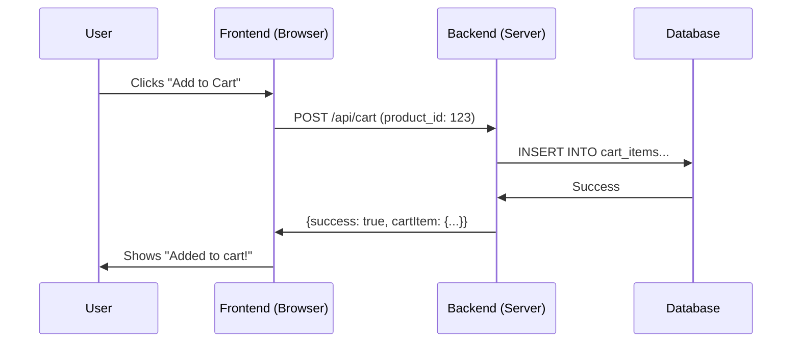
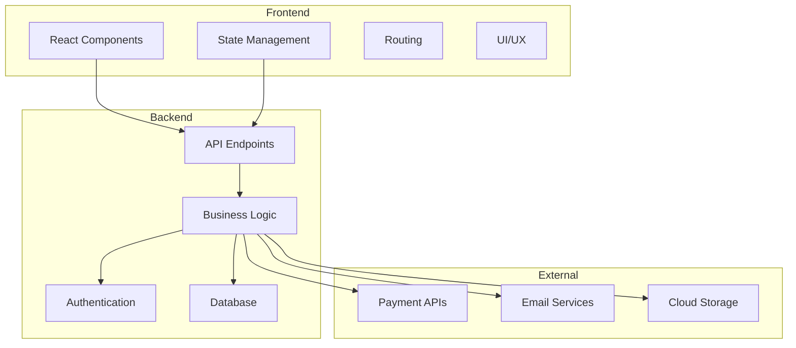

# Module 1: What is Backend? (Frontend vs Backend)

## Learning Objectives
- Understand the difference between frontend and backend
- Learn about client-server architecture
- Understand why we need a backend
- Relate backend concepts to frontend patterns

## 1.1 Frontend vs Backend: The Restaurant Analogy

### Frontend (The Dining Room)
**What you see and interact with:**
- The menu (UI components)
- The waiter taking your order (event handlers)
- The presentation of food (data visualization)
- The ambiance and decor (styling)

**Frontend analogy in code:**
```javascript
// Frontend: What the user sees and interacts with
function ProductCard({ product }) {
  const [isInCart, setIsInCart] = useState(false);
  
  const handleAddToCart = () => {
    // This is where frontend meets backend!
    addToCart(product.id);
    setIsInCart(true);
  };
  
  return (
    <div className="product-card">
      
      <h3>{product.name}</h3>
      <p>${product.price}</p>
      <button onClick={handleAddToCart}>Add to Cart</button>
    </div>
  );
}
```

### Backend (The Kitchen)
**What happens behind the scenes:**
- Storing ingredients (database)
- Following recipes (business logic)
- Managing inventory (data management)
- Coordinating orders (API endpoints)
- Ensuring food safety (security)

**Backend analogy in code:**
```javascript
// Backend: What happens when user clicks "Add to Cart"
async function addToCart(productId, userId) {
  // 1. Check if product exists (like checking ingredients)
  const product = await getProduct(productId);
  if (!product) throw new Error('Product not found');
  
  // 2. Check inventory (like checking if we have enough ingredients)
  if (product.inventory < 1) throw new Error('Out of stock');
  
  // 3. Add to user's cart (like adding order to kitchen queue)
  const cartItem = await createCartItem({
    userId,
    productId,
    quantity: 1
  });
  
  // 4. Update inventory (like using up ingredients)
  await updateProductInventory(productId, product.inventory - 1);
  
  return cartItem;
}
```

## 1.2 Why Do We Need a Backend?

### Problem 1: Data Persistence
**Frontend Problem:**
```javascript
// This data disappears when user refreshes the page!
const [cartItems, setCartItems] = useState([]);
```

**Backend Solution:**
```javascript
// Data is stored in a database and persists
const cartItems = await supabase
  .from('cart_items')
  .select('*')
  .eq('user_id', userId);
```

**WHY**: Frontend state is temporary (like RAM), backend storage is permanent (like a hard drive)

### Problem 2: Security
**Frontend Problem:**
```javascript
// Anyone can see this in browser dev tools!
const API_KEY = 'secret-payment-key';
const userBalance = 1000000; // User could modify this!
```

**Backend Solution:**
```javascript
// This runs on the server, users can't see or modify it
const processPayment = async (amount, userId) => {
  const user = await getUserFromDatabase(userId);
  if (user.balance >= amount) {
    // Process payment securely
  }
};
```

**WHY**: Backend is like a secure vault, frontend is like a public display window

### Problem 3: Business Logic
**Frontend Problem:**
```javascript
// What if pricing rules change? Update every user's browser?
const calculateDiscount = (price) => {
  if (price > 50) return price * 0.1; // 10% discount
  return 0;
};
```

**Backend Solution:**
```javascript
// Centralized logic, changes apply immediately to all users
const calculateDiscount = async (price, userId) => {
  const discountRules = await getDiscountRules();
  const userTier = await getUserTier(userId);
  // Complex business logic here
  return calculatedDiscount;
};
```

**WHY**: Backend is like having one master recipe book, frontend is like having copies that might get outdated

## 1.3 Client-Server Architecture

### The Request-Response Cycle



**Frontend analogy**: Like calling a function, but the function runs on a different computer

```javascript
// Frontend: Making a request (like calling a function)
const response = await fetch('/api/cart', {
  method: 'POST',
  body: JSON.stringify({ productId: 123 })
});
const result = await response.json();

// Backend: Handling the request (like the function implementation)
app.post('/api/cart', async (req, res) => {
  const { productId } = req.body;
  const cartItem = await addToCart(productId);
  res.json({ success: true, cartItem });
});
```

## 1.4 Practical Exercise: Identifying Frontend vs Backend

**Scenario**: User wants to leave a product review

**Identify which parts are frontend vs backend:**

1. Review form with star rating component
2. Validating review content (no spam, appropriate language)
3. Showing loading spinner while submitting
4. Storing review in database
5. Displaying success message
6. Calculating new average rating for product
7. Updating UI with new review
8. Sending email notification to product owner

**Answers:**
1. ✅ **Frontend** - UI component
2. ✅ **Backend** - Business logic and security
3. ✅ **Frontend** - UI state management
4. ✅ **Backend** - Data persistence
5. ✅ **Frontend** - UI feedback
6. ✅ **Backend** - Data processing
7. ✅ **Frontend** - UI updates
8. ✅ **Backend** - External integrations

## 1.5 Real-World Examples

### Example 1: E-commerce Product Page

**Frontend responsibilities:**
- Display product images in a carousel
- Show product name, price, description
- Render star ratings visually
- Handle "Add to Cart" button click
- Show loading states
- Display error messages

**Backend responsibilities:**
- Fetch product data from database
- Calculate discounted price based on user tier
- Check inventory availability
- Process "Add to Cart" request
- Update cart in database
- Log user activity for analytics

### Example 2: User Authentication

**Frontend responsibilities:**
- Login form with email/password inputs
- Show/hide password toggle
- Display validation errors (empty fields)
- Redirect to dashboard after login
- Store auth token in cookies/localStorage

**Backend responsibilities:**
- Verify email and password against database
- Hash passwords securely
- Generate authentication tokens (JWT)
- Check if account is active/verified
- Rate limit login attempts (prevent brute force)
- Log security events

## 1.6 Common Misconceptions

### Misconception 1: "Frontend is easy, backend is hard"
**Reality**: Both have different complexities
- Frontend: Complex UI interactions, state management, performance optimization
- Backend: Data modeling, security, scalability, business logic

### Misconception 2: "I can do everything in the frontend"
**Reality**: You can't because:
- Users can modify frontend code (security risk)
- Frontend can't store data permanently
- API keys would be exposed
- Business logic could be reverse-engineered

### Misconception 3: "Backend is just a database"
**Reality**: Backend includes:
- Database (data storage)
- API endpoints (communication layer)
- Business logic (rules and calculations)
- Authentication (security)
- External integrations (payments, emails, etc.)
- Background jobs (scheduled tasks)

## 1.7 The Full Stack Picture



## 1.8 Key Takeaways

- **Frontend**: What users see and interact with (presentation layer)
- **Backend**: What processes, stores, and manages data (logic and data layer)
- **They work together**: Frontend makes requests, backend processes them
- **Think of it like**: Frontend is the interface, backend is the engine
- **Security**: Backend is trusted, frontend is not
- **Data**: Backend stores permanently, frontend stores temporarily

## 1.9 What You'll Learn Next

In the upcoming modules, you'll learn:
- **Module 2**: Databases (how to store and retrieve data)
- **Module 3**: APIs (how frontend and backend communicate)
- **Module 4**: Authentication (how to identify users securely)
- **Module 5**: Supabase (a complete backend platform)
- **Module 6**: Edge Functions (custom backend logic)

## 1.10 Quick Quiz

Test your understanding:

1. **Q**: Can you store sensitive API keys in frontend code?
   **A**: No! Frontend code is visible to users. API keys must be in backend.

2. **Q**: Where should you validate user input?
   **A**: Both! Frontend for UX (immediate feedback), Backend for security (can't be bypassed).

3. **Q**: If you want data to persist after page refresh, where should it be stored?
   **A**: Backend database. Frontend state is temporary.

4. **Q**: Who can modify frontend code?
   **A**: Anyone! Users can open dev tools and change JavaScript. That's why backend validation is crucial.

5. **Q**: What's the main difference between frontend and backend?
   **A**: Frontend runs in the user's browser (untrusted), backend runs on your server (trusted).

## Next Module Preview

In Module 2, we'll dive into databases - think of them as "persistent state management" for your entire application, not just one user session!
