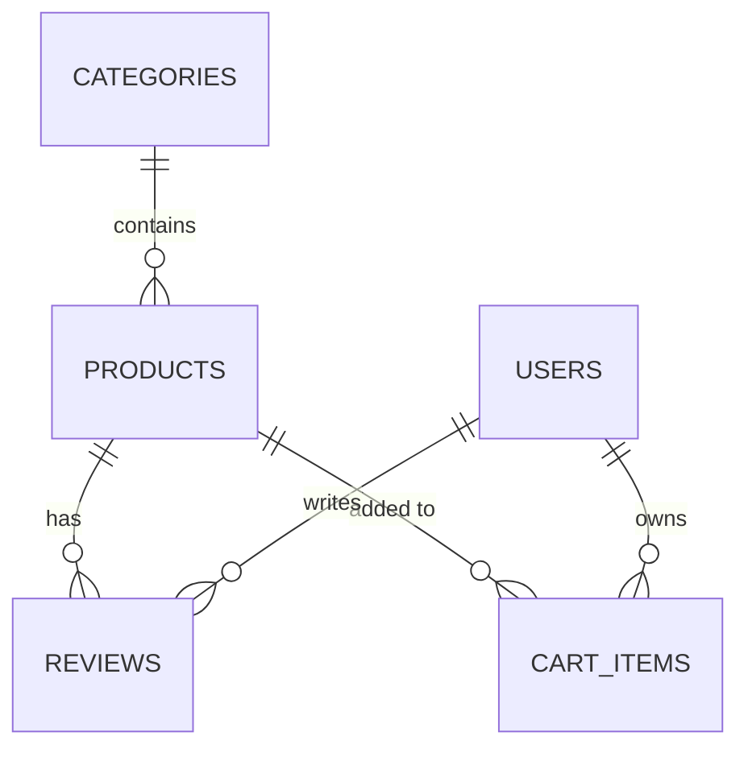

# Module 2: Database Basics (Think: Persistent State Management)

## Learning Objectives
- Understand what databases are and why we need them
- Learn the difference between SQL and NoSQL databases
- Understand database relationships
- Design a simple database schema
- Relate database concepts to frontend state management

## 2.1 What is a Database?

### Frontend State vs Database Storage

**Frontend State (Temporary):**
```javascript
// This disappears when user closes browser
const [products, setProducts] = useState([
  { id: 1, name: 'Ramen Mix', price: 15.99, inventory: 50 },
  { id: 2, name: 'Spicy Mix', price: 17.99, inventory: 30 }
]);

// When user refreshes page, this data is gone!
```

**Database Storage (Permanent):**
```sql
-- This data persists even when server restarts
CREATE TABLE products (
  id SERIAL PRIMARY KEY,
  name TEXT NOT NULL,
  price DECIMAL(10,2) NOT NULL,
  inventory INTEGER DEFAULT 0
);

INSERT INTO products (name, price, inventory) VALUES 
('Ramen Mix', 15.99, 50),
('Spicy Mix', 17.99, 30);
```

**WHY**: Database is like saving your work to a file, frontend state is like keeping it in memory

### Frontend Analogy: Global State Management

**Think of a database like Redux/Zustand, but:**
- It persists between sessions
- Multiple users can access the same data
- It has built-in rules and validation
- It can handle complex relationships

```javascript
// Frontend: Zustand store (temporary)
const useStore = create((set) => ({
  products: [],
  addProduct: (product) => set((state) => ({ 
    products: [...state.products, product] 
  }))
}));

// Database: Persistent store (permanent)
// Same concept, but data survives server restarts
```

## 2.2 SQL vs NoSQL: Choosing the Right Tool

### SQL Databases (Like Structured Objects)

**Think of SQL like TypeScript interfaces:**
```typescript
// TypeScript: Strict structure
interface Product {
  id: number;
  name: string;
  price: number;
  categoryId: number; // Must reference a valid category
}

interface Category {
  id: number;
  name: string;
}
```

```sql
-- SQL: Strict structure with relationships
CREATE TABLE categories (
  id SERIAL PRIMARY KEY,
  name TEXT NOT NULL
);

CREATE TABLE products (
  id SERIAL PRIMARY KEY,
  name TEXT NOT NULL,
  price DECIMAL(10,2) NOT NULL,
  category_id INTEGER REFERENCES categories(id)
);
```

**WHY SQL for E-commerce:**
- Products belong to categories (relationships)
- Orders contain multiple products (complex queries)
- Need to ensure data consistency (no orphaned records)
- ACID properties (Atomicity, Consistency, Isolation, Durability)

### NoSQL Databases (Like Flexible Objects)

**Think of NoSQL like JavaScript objects:**
```javascript
// JavaScript: Flexible structure
const products = [
  {
    id: 1,
    name: 'Ramen Mix',
    price: 15.99,
    category: { name: 'Mixes', icon: '🍜' }, // Embedded
    tags: ['spicy', 'vegetarian'], // Arrays
    metadata: { // Any structure
      supplier: 'Local Farm',
      organic: true
    }
  }
];
```

**When to use NoSQL:**
- Rapid prototyping
- Flexible data structures
- Horizontal scaling needs
- Real-time applications

**For our Ramen Bae clone, we'll use SQL (PostgreSQL) because:**
- E-commerce needs relationships (products → categories → reviews)
- We need data consistency (inventory management)
- Complex queries (sales reports, recommendations)

## 2.3 Database Relationships (Like Object References)

### One-to-Many (Most Common)

**Frontend analogy:**
```javascript
// One category has many products
const category = {
  id: 1,
  name: 'Ramen Mixes',
  products: [ // Array of related products
    { id: 1, name: 'Classic Mix' },
    { id: 2, name: 'Spicy Mix' }
  ]
};
```

**Database implementation:**
```sql
-- Categories table (the "one")
CREATE TABLE categories (
  id SERIAL PRIMARY KEY,
  name TEXT NOT NULL
);

-- Products table (the "many")
CREATE TABLE products (
  id SERIAL PRIMARY KEY,
  name TEXT NOT NULL,
  category_id INTEGER REFERENCES categories(id)
);

-- Query: Get all products in a category
SELECT p.* FROM products p 
WHERE p.category_id = 1;
```

### Many-to-Many (Through Junction Table)

**Frontend analogy:**
```javascript
// Products can have multiple tags, tags can be on multiple products
const product = {
  id: 1,
  name: 'Spicy Mix',
  tags: ['spicy', 'vegetarian', 'gluten-free']
};

const tag = {
  id: 1,
  name: 'spicy',
  products: [1, 2, 5, 8] // Multiple products have this tag
};
```

**Database implementation:**
```sql
-- Products table
CREATE TABLE products (
  id SERIAL PRIMARY KEY,
  name TEXT NOT NULL
);

-- Tags table
CREATE TABLE tags (
  id SERIAL PRIMARY KEY,
  name TEXT NOT NULL
);

-- Junction table (connects products and tags)
CREATE TABLE product_tags (
  product_id INTEGER REFERENCES products(id),
  tag_id INTEGER REFERENCES tags(id),
  PRIMARY KEY (product_id, tag_id)
);

-- Query: Get all tags for a product
SELECT t.name FROM tags t
JOIN product_tags pt ON t.id = pt.tag_id
WHERE pt.product_id = 1;
```

## 2.4 Designing Our Ramen Bae Database Schema

### Step 1: Identify Entities (Like Defining Components)

**Think like React components:**
```javascript
// What are the main "things" in our app?
<ProductCard />     // → products table
<CategoryFilter />  // → categories table
<ReviewList />      // → reviews table
<CartItem />        // → cart_items table
<UserProfile />     // → users table (handled by Supabase Auth)
```

### Step 2: Define Relationships



### Step 3: Create Tables

```sql
-- Categories (Mixes, Single Toppings, Bundles, etc.)
CREATE TABLE categories (
  id UUID PRIMARY KEY DEFAULT gen_random_uuid(),
  name TEXT NOT NULL,
  slug TEXT UNIQUE NOT NULL,
  icon TEXT,
  created_at TIMESTAMP WITH TIME ZONE DEFAULT NOW()
);

-- Products
CREATE TABLE products (
  id UUID PRIMARY KEY DEFAULT gen_random_uuid(),
  name TEXT NOT NULL,
  slug TEXT UNIQUE NOT NULL,
  description TEXT,
  price DECIMAL(10,2) NOT NULL,
  compare_at_price DECIMAL(10,2),
  inventory INTEGER DEFAULT 0,
  category_id UUID REFERENCES categories(id),
  images JSONB, -- Array of image objects
  ingredients TEXT[],
  allergens TEXT[],
  features TEXT[],
  accent_color TEXT DEFAULT '#fe90b8',
  created_at TIMESTAMP WITH TIME ZONE DEFAULT NOW(),
  updated_at TIMESTAMP WITH TIME ZONE DEFAULT NOW()
);

-- Reviews
CREATE TABLE reviews (
  id UUID PRIMARY KEY DEFAULT gen_random_uuid(),
  product_id UUID REFERENCES products(id) ON DELETE CASCADE,
  user_id UUID REFERENCES auth.users(id),
  rating INTEGER CHECK (rating >= 1 AND rating <= 5),
  title TEXT,
  body TEXT NOT NULL,
  verified BOOLEAN DEFAULT FALSE,
  helpful_count INTEGER DEFAULT 0,
  created_at TIMESTAMP WITH TIME ZONE DEFAULT NOW()
);

-- Cart Items
CREATE TABLE cart_items (
  id UUID PRIMARY KEY DEFAULT gen_random_uuid(),
  user_id UUID REFERENCES auth.users(id),
  session_id TEXT, -- For anonymous users
  product_id UUID REFERENCES products(id),
  quantity INTEGER NOT NULL DEFAULT 1,
  created_at TIMESTAMP WITH TIME ZONE DEFAULT NOW(),
  updated_at TIMESTAMP WITH TIME ZONE DEFAULT NOW()
);
```

## 2.5 Database Operations (CRUD)

### Frontend State Operations vs Database Operations

**Frontend (useState):**
```javascript
const [products, setProducts] = useState([]);

// Create
setProducts([...products, newProduct]);

// Read
const product = products.find(p => p.id === 1);

// Update
setProducts(products.map(p => 
  p.id === 1 ? { ...p, name: 'New Name' } : p
));

// Delete
setProducts(products.filter(p => p.id !== 1));
```

**Database (SQL):**
```sql
-- Create
INSERT INTO products (name, price, category_id) 
VALUES ('Spicy Mix', 17.99, 1);

-- Read
SELECT * FROM products WHERE id = 1;

-- Update
UPDATE products 
SET name = 'New Name' 
WHERE id = 1;

-- Delete
DELETE FROM products WHERE id = 1;
```

**WHY similar patterns**: Both manage collections of data, but database operations are permanent

## 2.6 Advanced Queries

### Filtering and Sorting

**Frontend analogy:**
```javascript
// Filter and sort products
const filtered = products
  .filter(p => p.price >= 10 && p.price <= 50)
  .sort((a, b) => b.created_at - a.created_at)
  .slice(0, 10);
```

**Database (SQL):**
```sql
SELECT * FROM products
WHERE price >= 10 AND price <= 50
ORDER BY created_at DESC
LIMIT 10;
```

### Joins (Combining Data)

**Frontend analogy:**
```javascript
// Manually combine data from different arrays
const productsWithCategories = products.map(product => ({
  ...product,
  category: categories.find(c => c.id === product.categoryId)
}));
```

**Database (SQL):**
```sql
-- Automatically combine related data
SELECT 
  p.*,
  c.name as category_name,
  c.icon as category_icon
FROM products p
JOIN categories c ON p.category_id = c.id;
```

### Aggregations (Calculations)

**Frontend analogy:**
```javascript
// Calculate average rating
const avgRating = reviews.reduce((sum, r) => sum + r.rating, 0) / reviews.length;

// Count reviews per product
const reviewCounts = products.map(p => ({
  productId: p.id,
  count: reviews.filter(r => r.productId === p.id).length
}));
```

**Database (SQL):**
```sql
-- Calculate average rating
SELECT AVG(rating) as avg_rating
FROM reviews
WHERE product_id = 1;

-- Count reviews per product
SELECT 
  product_id,
  COUNT(*) as review_count,
  AVG(rating) as avg_rating
FROM reviews
GROUP BY product_id;
```

## 2.7 Data Integrity and Constraints

### Primary Keys (Unique Identifiers)

**Frontend analogy:**
```javascript
// React needs unique keys for list items
{products.map(product => (
  <ProductCard key={product.id} product={product} />
))}
```

**Database:**
```sql
-- Every table needs a primary key
CREATE TABLE products (
  id UUID PRIMARY KEY DEFAULT gen_random_uuid(),
  -- ...
);
```

### Foreign Keys (Relationships)

**Frontend analogy:**
```javascript
// Ensuring references are valid
const addProduct = (product) => {
  const categoryExists = categories.some(c => c.id === product.categoryId);
  if (!categoryExists) {
    throw new Error('Invalid category');
  }
  // Add product
};
```

**Database:**
```sql
-- Database enforces valid references automatically
CREATE TABLE products (
  id UUID PRIMARY KEY,
  category_id UUID REFERENCES categories(id), -- Must be valid category
  -- ...
);

-- This will fail if category doesn't exist
INSERT INTO products (name, category_id) 
VALUES ('New Product', 'invalid-id'); -- ERROR!
```

### Check Constraints (Validation)

**Frontend analogy:**
```javascript
// Validate data before saving
const addReview = (review) => {
  if (review.rating < 1 || review.rating > 5) {
    throw new Error('Rating must be 1-5');
  }
  // Add review
};
```

**Database:**
```sql
-- Database enforces validation automatically
CREATE TABLE reviews (
  id UUID PRIMARY KEY,
  rating INTEGER CHECK (rating >= 1 AND rating <= 5),
  -- ...
);

-- This will fail
INSERT INTO reviews (rating) VALUES (10); -- ERROR!
```

## 2.8 Indexes (Performance Optimization)

**Frontend analogy:**
```javascript
// Searching through array (slow for large arrays)
const product = products.find(p => p.slug === 'spicy-mix');

// Using a Map for faster lookups
const productsBySlug = new Map(products.map(p => [p.slug, p]));
const product = productsBySlug.get('spicy-mix'); // Much faster!
```

**Database:**
```sql
-- Create index for faster queries
CREATE INDEX idx_products_slug ON products(slug);

-- Now this query is much faster
SELECT * FROM products WHERE slug = 'spicy-mix';
```

## 2.9 Practical Exercise: Design a Wishlist Feature

**Scenario**: Add a "Wishlist" feature to our Ramen Bae clone

**Your task**: Design the database table(s) needed

**Think about:**
1. What entities are involved? (Users, Products, Wishlists)
2. What relationships exist? (User has wishlist, wishlist contains products)
3. What data do we need to store? (user_id, product_id, date_added)

**Solution:**
```sql
CREATE TABLE wishlist_items (
  id UUID PRIMARY KEY DEFAULT gen_random_uuid(),
  user_id UUID REFERENCES auth.users(id) ON DELETE CASCADE,
  product_id UUID REFERENCES products(id) ON DELETE CASCADE,
  created_at TIMESTAMP WITH TIME ZONE DEFAULT NOW(),
  UNIQUE(user_id, product_id) -- Prevent duplicates
);

-- Create index for faster queries
CREATE INDEX idx_wishlist_user ON wishlist_items(user_id);
CREATE INDEX idx_wishlist_product ON wishlist_items(product_id);
```

**Frontend analogy:**
```javascript
// Like having a Set to prevent duplicates
const wishlist = new Set([productId1, productId2]);
```

## 2.10 Key Takeaways

- **Database = Persistent global state** for your entire application
- **SQL databases** are like TypeScript - structured and strict
- **Relationships** connect related data (like object references)
- **CRUD operations** are similar to array/object manipulation, but permanent
- **Constraints** enforce data integrity automatically
- **Indexes** speed up queries (like using Maps instead of arrays)
- **Design first**: Think about entities and relationships before coding

## 2.11 Common Database Patterns

### Soft Deletes
```sql
-- Instead of deleting, mark as deleted
ALTER TABLE products ADD COLUMN deleted_at TIMESTAMP;

-- "Delete" a product
UPDATE products SET deleted_at = NOW() WHERE id = 1;

-- Query only active products
SELECT * FROM products WHERE deleted_at IS NULL;
```

### Timestamps
```sql
-- Track when records are created/updated
CREATE TABLE products (
  id UUID PRIMARY KEY,
  -- ...
  created_at TIMESTAMP WITH TIME ZONE DEFAULT NOW(),
  updated_at TIMESTAMP WITH TIME ZONE DEFAULT NOW()
);
```

### Slugs for URLs
```sql
-- Human-readable URLs
CREATE TABLE products (
  id UUID PRIMARY KEY,
  name TEXT NOT NULL,
  slug TEXT UNIQUE NOT NULL, -- 'spicy-ramen-mix'
  -- ...
);

-- Access via: /products/spicy-ramen-mix instead of /products/123-456-789
```

## Next Module Preview

In Module 3, we'll learn about APIs - think of them as "functions that run on the server" that your frontend can call!
