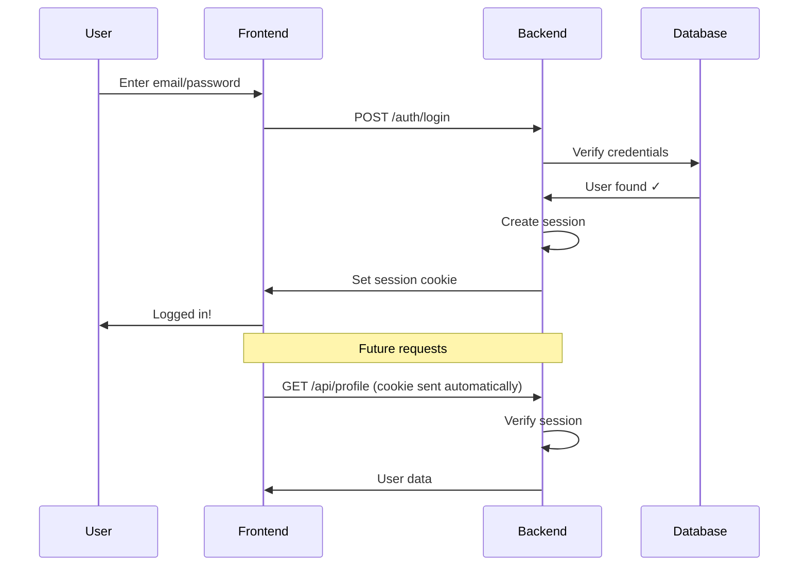

# Module 4: Authentication (Think: Secure User State Management)

## Learning Objectives
- Understand authentication vs authorization
- Learn how sessions and tokens work
- Implement authentication with Supabase
- Protect API routes and pages
- Relate auth concepts to frontend state management

## 4.1 What is Authentication?

### Frontend State Management vs Authentication

**Frontend State (Temporary, Insecure):**
```javascript
// This is NOT authentication!
const [currentUser, setCurrentUser] = useState({
  id: 1,
  email: 'user@example.com',
  isAdmin: false // User could change this in dev tools!
});

// Anyone can modify this
setCurrentUser({ ...currentUser, isAdmin: true }); // 😱
```

**Authentication (Persistent, Secure):**
```javascript
// Server verifies identity and creates secure session
const { data: { user }, error } = await supabase.auth.signInWithPassword({
  email: 'user@example.com',
  password: 'secure-password'
});

// Server stores: "This user is authenticated"
// User can't fake this - it's verified on the server
```

**WHY**: Authentication proves "you are who you say you are" in a way that can't be faked

**Frontend analogy**: Like having a VIP wristband at a concert - you can't just draw one on your arm, it has to be given by security

## 4.2 Authentication vs Authorization

### The Difference

**Authentication**: "Who are you?"
```javascript
// Proving identity
await supabase.auth.signIn({ email, password });
// Result: "You are user@example.com"
```

**Authorization**: "What are you allowed to do?"
```javascript
// Checking permissions
if (user.role === 'admin') {
  // Allow access to admin panel
} else {
  // Deny access
}
```

**Frontend analogy:**
- **Authentication** = Showing your ID to enter a building
- **Authorization** = Your ID badge determines which floors you can access

### Real-World Example

```typescript
// Authentication: Verify who the user is
export async function GET(request: NextRequest) {
  const supabase = createClient();
  const { data: { user } } = await supabase.auth.getUser();
  
  if (!user) {
    return NextResponse.json(
      { error: 'Not authenticated' },
      { status: 401 } // Unauthorized (should be "Unauthenticated")
    );
  }
  
  // Authorization: Check what they can do
  const { data: profile } = await supabase
    .from('profiles')
    .select('role')
    .eq('id', user.id)
    .single();
  
  if (profile.role !== 'admin') {
    return NextResponse.json(
      { error: 'Not authorized' },
      { status: 403 } // Forbidden
    );
  }
  
  // User is authenticated AND authorized
  return NextResponse.json({ message: 'Welcome, admin!' });
}
```

## 4.3 How Authentication Works: Sessions and Tokens

### Session-Based Authentication (Traditional)

**Frontend analogy - Cookie jar:**
```javascript
// Server gives you a cookie (session ID)
// Browser automatically sends it with every request
// Like having a ticket stub that proves you paid for entry
```

**Flow:**


### Token-Based Authentication (Modern - JWT)

**Frontend analogy - Access badge:**
```javascript
// Server gives you a signed token (like a tamper-proof badge)
// You include it in every request
// Server can verify it's real without checking database
```

**JWT Structure:**
```javascript
// JWT = Header.Payload.Signature
const token = 'eyJhbGciOiJIUzI1NiIsInR5cCI6IkpXVCJ9.eyJ1c2VyX2lkIjoiMTIzIiwiZW1haWwiOiJ1c2VyQGV4YW1wbGUuY29tIn0.signature';

// Decoded payload (anyone can read this!)
{
  user_id: '123',
  email: 'user@example.com',
  exp: 1735689600 // Expiration timestamp
}

// But only server can verify the signature
// If payload is modified, signature won't match
```

**WHY JWT**: Server doesn't need to store sessions - token contains all info

## 4.4 Implementing Authentication with Supabase

### Setup Supabase Auth

```typescript
// lib/supabase/client.ts (Client-side)
import { createBrowserClient } from '@supabase/ssr';

export function createClient() {
  return createBrowserClient(
    process.env.NEXT_PUBLIC_SUPABASE_URL!,
    process.env.NEXT_PUBLIC_SUPABASE_ANON_KEY!
  );
}

// lib/supabase/server.ts (Server-side)
import { createServerClient } from '@supabase/ssr';
import { cookies } from 'next/headers';

export function createClient() {
  const cookieStore = cookies();
  
  return createServerClient(
    process.env.NEXT_PUBLIC_SUPABASE_URL!,
    process.env.NEXT_PUBLIC_SUPABASE_ANON_KEY!,
    {
      cookies: {
        get(name: string) {
          return cookieStore.get(name)?.value;
        },
      },
    }
  );
}
```

### Sign Up Flow

```typescript
// app/api/auth/signup/route.ts
export async function POST(request: NextRequest) {
  try {
    const { email, password, name } = await request.json();
    
    // Validate input
    if (!email || !password) {
      return NextResponse.json(
        { error: 'Email and password required' },
        { status: 400 }
      );
    }
    
    const supabase = createClient();
    
    // Create user account
    const { data, error } = await supabase.auth.signUp({
      email,
      password,
      options: {
        data: {
          name, // Stored in user metadata
        },
      },
    });
    
    if (error) {
      return NextResponse.json(
        { error: error.message },
        { status: 400 }
      );
    }
    
    // Supabase sends confirmation email automatically
    return NextResponse.json({
      message: 'Check your email to confirm your account',
      user: data.user
    }, { status: 201 });
    
  } catch (error) {
    return handleApiError(error);
  }
}
```

**Frontend component:**
```typescript
// components/auth/signup-form.tsx
'use client';

import { useState } from 'react';
import { createClient } from '@/lib/supabase/client';

export function SignUpForm() {
  const [email, setEmail] = useState('');
  const [password, setPassword] = useState('');
  const [loading, setLoading] = useState(false);
  const supabase = createClient();
  
  const handleSignUp = async (e: React.FormEvent) => {
    e.preventDefault();
    setLoading(true);
    
    const { data, error } = await supabase.auth.signUp({
      email,
      password,
    });
    
    if (error) {
      alert(error.message);
    } else {
      alert('Check your email to confirm your account!');
    }
    
    setLoading(false);
  };
  
  return (
    <form onSubmit={handleSignUp}>
      <input
        type="email"
        value={email}
        onChange={(e) => setEmail(e.target.value)}
        placeholder="Email"
        required
      />
      <input
        type="password"
        value={password}
        onChange={(e) => setPassword(e.target.value)}
        placeholder="Password"
        required
      />
      <button type="submit" disabled={loading}>
        {loading ? 'Signing up...' : 'Sign Up'}
      </button>
    </form>
  );
}
```

### Sign In Flow

```typescript
// components/auth/signin-form.tsx
'use client';

import { useState } from 'react';
import { createClient } from '@/lib/supabase/client';
import { useRouter } from 'next/navigation';

export function SignInForm() {
  const [email, setEmail] = useState('');
  const [password, setPassword] = useState('');
  const [loading, setLoading] = useState(false);
  const router = useRouter();
  const supabase = createClient();
  
  const handleSignIn = async (e: React.FormEvent) => {
    e.preventDefault();
    setLoading(true);
    
    const { data, error } = await supabase.auth.signInWithPassword({
      email,
      password,
    });
    
    if (error) {
      alert(error.message);
    } else {
      router.push('/dashboard'); // Redirect after login
      router.refresh(); // Refresh server components
    }
    
    setLoading(false);
  };
  
  return (
    <form onSubmit={handleSignIn}>
      <input
        type="email"
        value={email}
        onChange={(e) => setEmail(e.target.value)}
        placeholder="Email"
        required
      />
      <input
        type="password"
        value={password}
        onChange={(e) => setPassword(e.target.value)}
        placeholder="Password"
        required
      />
      <button type="submit" disabled={loading}>
        {loading ? 'Signing in...' : 'Sign In'}
      </button>
    </form>
  );
}
```

### Social Login (OAuth)

```typescript
// components/auth/social-login.tsx
'use client';

import { createClient } from '@/lib/supabase/client';

export function SocialLogin() {
  const supabase = createClient();
  
  const handleGoogleLogin = async () => {
    const { data, error } = await supabase.auth.signInWithOAuth({
      provider: 'google',
      options: {
        redirectTo: `${window.location.origin}/auth/callback`,
      },
    });
    
    if (error) {
      alert(error.message);
    }
  };
  
  const handleGithubLogin = async () => {
    const { data, error } = await supabase.auth.signInWithOAuth({
      provider: 'github',
      options: {
        redirectTo: `${window.location.origin}/auth/callback`,
      },
    });
    
    if (error) {
      alert(error.message);
    }
  };
  
  return (
    <div>
      <button onClick={handleGoogleLogin}>
        Sign in with Google
      </button>
      <button onClick={handleGithubLogin}>
        Sign in with GitHub
      </button>
    </div>
  );
}
```

**OAuth callback handler:**
```typescript
// app/auth/callback/route.ts
import { createClient } from '@/lib/supabase/server';
import { NextResponse } from 'next/server';

export async function GET(request: NextRequest) {
  const requestUrl = new URL(request.url);
  const code = requestUrl.searchParams.get('code');
  
  if (code) {
    const supabase = createClient();
    await supabase.auth.exchangeCodeForSession(code);
  }
  
  // Redirect to home page
  return NextResponse.redirect(requestUrl.origin);
}
```

## 4.5 Protecting Routes and API Endpoints

### Middleware for Route Protection

```typescript
// middleware.ts
import { createServerClient } from '@supabase/ssr';
import { NextResponse } from 'next/server';
import type { NextRequest } from 'next/server';

export async function middleware(request: NextRequest) {
  const response = NextResponse.next();
  
  const supabase = createServerClient(
    process.env.NEXT_PUBLIC_SUPABASE_URL!,
    process.env.NEXT_PUBLIC_SUPABASE_ANON_KEY!,
    {
      cookies: {
        get(name: string) {
          return request.cookies.get(name)?.value;
        },
        set(name: string, value: string, options: any) {
          response.cookies.set({ name, value, ...options });
        },
        remove(name: string, options: any) {
          response.cookies.set({ name, value: '', ...options });
        },
      },
    }
  );
  
  const { data: { user } } = await supabase.auth.getUser();
  
  // Protect dashboard routes
  if (request.nextUrl.pathname.startsWith('/dashboard') && !user) {
    return NextResponse.redirect(new URL('/login', request.url));
  }
  
  // Redirect logged-in users away from auth pages
  if (request.nextUrl.pathname.startsWith('/login') && user) {
    return NextResponse.redirect(new URL('/dashboard', request.url));
  }
  
  return response;
}

export const config = {
  matcher: ['/dashboard/:path*', '/login', '/signup'],
};
```

### Protected API Route

```typescript
// app/api/profile/route.ts
import { createClient } from '@/lib/supabase/server';

export async function GET(request: NextRequest) {
  const supabase = createClient();
  
  // Get authenticated user
  const { data: { user }, error: authError } = await supabase.auth.getUser();
  
  if (authError || !user) {
    return NextResponse.json(
      { error: 'Authentication required' },
      { status: 401 }
    );
  }
  
  // Fetch user profile
  const { data: profile, error } = await supabase
    .from('profiles')
    .select('*')
    .eq('id', user.id)
    .single();
  
  if (error) {
    return NextResponse.json(
      { error: 'Profile not found' },
      { status: 404 }
    );
  }
  
  return NextResponse.json({ profile });
}
```

### Protected Server Component

```typescript
// app/dashboard/page.tsx
import { createClient } from '@/lib/supabase/server';
import { redirect } from 'next/navigation';

export default async function DashboardPage() {
  const supabase = createClient();
  
  const { data: { user } } = await supabase.auth.getUser();
  
  if (!user) {
    redirect('/login');
  }
  
  return (
    <div>
      <h1>Welcome, {user.email}!</h1>
      {/* Dashboard content */}
    </div>
  );
}
```

## 4.6 User Context and State Management

### Auth Context Provider

```typescript
// contexts/auth-context.tsx
'use client';

import { createContext, useContext, useEffect, useState } from 'react';
import { createClient } from '@/lib/supabase/client';
import type { User } from '@supabase/supabase-js';

type AuthContextType = {
  user: User | null;
  loading: boolean;
  signOut: () => Promise<void>;
};

const AuthContext = createContext<AuthContextType>({
  user: null,
  loading: true,
  signOut: async () => {},
});

export function AuthProvider({ children }: { children: React.ReactNode }) {
  const [user, setUser] = useState<User | null>(null);
  const [loading, setLoading] = useState(true);
  const supabase = createClient();
  
  useEffect(() => {
    // Get initial session
    supabase.auth.getSession().then(({ data: { session } }) => {
      setUser(session?.user ?? null);
      setLoading(false);
    });
    
    // Listen for auth changes
    const { data: { subscription } } = supabase.auth.onAuthStateChange(
      (_event, session) => {
        setUser(session?.user ?? null);
      }
    );
    
    return () => subscription.unsubscribe();
  }, []);
  
  const signOut = async () => {
    await supabase.auth.signOut();
    setUser(null);
  };
  
  return (
    <AuthContext.Provider value={{ user, loading, signOut }}>
      {children}
    </AuthContext.Provider>
  );
}

export const useAuth = () => useContext(AuthContext);
```

**Usage:**
```typescript
// components/user-menu.tsx
'use client';

import { useAuth } from '@/contexts/auth-context';

export function UserMenu() {
  const { user, loading, signOut } = useAuth();
  
  if (loading) return <div>Loading...</div>;
  
  if (!user) {
    return <a href="/login">Sign In</a>;
  }
  
  return (
    <div>
      <span>{user.email}</span>
      <button onClick={signOut}>Sign Out</button>
    </div>
  );
}
```

## 4.7 Practical Exercise: Implement User Profiles

**Your task**: Create a user profile system

**Requirements:**
1. Create profiles table linked to auth.users
2. API endpoint to get/update profile
3. Protected profile page
4. Profile form component

**Solution:**

```sql
-- Database schema
CREATE TABLE profiles (
  id UUID PRIMARY KEY REFERENCES auth.users(id) ON DELETE CASCADE,
  name TEXT,
  avatar_url TEXT,
  bio TEXT,
  created_at TIMESTAMP WITH TIME ZONE DEFAULT NOW(),
  updated_at TIMESTAMP WITH TIME ZONE DEFAULT NOW()
);

-- Trigger to create profile when user signs up
CREATE OR REPLACE FUNCTION public.handle_new_user()
RETURNS TRIGGER AS $$
BEGIN
  INSERT INTO public.profiles (id, name)
  VALUES (NEW.id, NEW.raw_user_meta_data->>'name');
  RETURN NEW;
END;
$$ LANGUAGE plpgsql SECURITY DEFINER;

CREATE TRIGGER on_auth_user_created
  AFTER INSERT ON auth.users
  FOR EACH ROW EXECUTE FUNCTION public.handle_new_user();
```

```typescript
// app/api/profile/route.ts
export async function PATCH(request: NextRequest) {
  const supabase = createClient();
  const { data: { user } } = await supabase.auth.getUser();
  
  if (!user) {
    return NextResponse.json({ error: 'Unauthorized' }, { status: 401 });
  }
  
  const { name, bio } = await request.json();
  
  const { data: profile, error } = await supabase
    .from('profiles')
    .update({ name, bio, updated_at: new Date().toISOString() })
    .eq('id', user.id)
    .select()
    .single();
  
  if (error) {
    return NextResponse.json({ error: error.message }, { status: 500 });
  }
  
  return NextResponse.json({ profile });
}
```

## 4.8 Key Takeaways

- **Authentication** = Proving identity (who you are)
- **Authorization** = Checking permissions (what you can do)
- **Sessions/Tokens** = Ways to maintain authenticated state
- **Supabase Auth** = Handles the complex parts for you
- **Always verify on server** = Never trust client-side auth state
- **Protect routes** = Use middleware and server-side checks

## Next Module Preview

In Module 5, we'll dive deep into the Supabase ecosystem and learn how to leverage its full power for rapid development!
