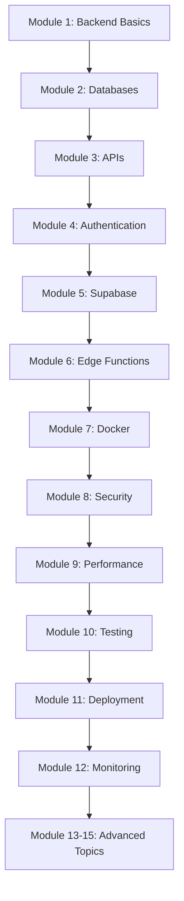

# Backend Learning Course - Progress Tracker

## Course Status

### ✅ Completed Modules

- **Module 1**: Backend Fundamentals (Frontend vs Backend)
- **Module 2**: Database Basics (Persistent State Management)
- **Module 3**: APIs and HTTP (Function Calls Over the Internet)
- **Module 4**: Authentication (Secure User State Management)
- **Module 5**: Supabase Ecosystem (Complete Backend Platform)
- **Module 6**: Edge Functions & Custom Backend Logic
- **Module 7**: Docker Fundamentals (Containerization)
- **Module 8**: Security Best Practices (Protecting Your App)
- **Module 9**: Performance Optimization (Making It Fast)
- **Module 10**: Testing Backend Code (Ensuring Reliability)
- **Module 11**: Deployment Strategies (Going to Production)
- **Module 12**: Monitoring and Debugging (Finding Issues)
- **Module 13**: Advanced Database Concepts (Mastering Data)
- **Module 14**: Caching Strategies (Making Everything Faster)
- **Module 15**: Final Project Integration (Complete System)

## Learning Path

## Key Concepts Learned So Far

### Module 1: Backend Fundamentals
- ✅ Frontend vs Backend differences
- ✅ Client-server architecture
- ✅ Why we need a backend
- ✅ Request-response cycle

### Module 2: Database Basics
- ✅ SQL vs NoSQL databases
- ✅ Database relationships (one-to-many, many-to-many)
- ✅ CRUD operations
- ✅ Schema design

### Module 3: APIs and HTTP
- ✅ HTTP methods (GET, POST, PUT, DELETE)
- ✅ Status codes (2xx, 4xx, 5xx)
- ✅ REST API design principles
- ✅ Query parameters and path parameters
- ✅ Error handling

### Module 4: Authentication
- ✅ Authentication vs Authorization
- ✅ Sessions vs Tokens (JWT)
- ✅ Supabase Auth implementation
- ✅ Protected routes and API endpoints
- ✅ Social login (OAuth)

### Module 5: Supabase Ecosystem
- ✅ Supabase query builder
- ✅ Row Level Security (RLS)
- ✅ Supabase Storage
- ✅ Real-time subscriptions
- ✅ Database functions and triggers

### Module 6: Edge Functions
- ✅ When to use Edge Functions
- ✅ Serverless concepts
- ✅ External API integration
- ✅ Payment processing
- ✅ Scheduled tasks (cron jobs)
- ✅ Environment variables and secrets

## Practical Skills Acquired

- [ ] Set up a PostgreSQL database
- [ ] Design database schemas with relationships
- [ ] Build REST API endpoints
- [ ] Implement authentication flows
- [ ] Use Supabase for backend operations
- [ ] Create Edge Functions for custom logic
- [ ] Integrate external APIs (Stripe, email services)
- [ ] Handle file uploads and storage
- [ ] Implement real-time features

## Next Steps

1. **Complete Module 7**: Learn Docker for containerization
2. **Complete Module 8**: Master security best practices
3. **Complete Module 9**: Optimize backend performance
4. **Start building**: Apply concepts to Ramen Bae clone

## Resources

- [Supabase Documentation](https://supabase.com/docs)
- [PostgreSQL Tutorial](https://www.postgresql.org/docs/)
- [REST API Best Practices](https://restfulapi.net/)
- [JWT.io](https://jwt.io/)
- [Docker Documentation](https://docs.docker.com/)

## Practice Projects

As you complete each module, try building these mini-projects:

1. **Blog API** (Modules 1-3): CRUD operations for posts
2. **User Authentication System** (Module 4): Sign up, login, protected routes
3. **File Upload Service** (Module 5): Image upload with Supabase Storage
4. **Payment Integration** (Module 6): Stripe checkout flow
5. **Real-time Chat** (Module 5): WebSocket-based messaging
6. **Scheduled Reports** (Module 6): Daily email summaries

## Questions to Answer

After each module, make sure you can answer:

- **Module 1**: Why can't we just use frontend for everything?
- **Module 2**: When should I use SQL vs NoSQL?
- **Module 3**: What's the difference between PUT and PATCH?
- **Module 4**: How do JWT tokens work?
- **Module 5**: What is Row Level Security and why is it important?
- **Module 6**: When should I use an Edge Function vs direct database access?

## Your Progress

Track your learning by checking off completed items:

- [ ] Read all module content
- [ ] Complete practical exercises
- [ ] Build mini-projects
- [ ] Answer review questions
- [ ] Apply to Ramen Bae clone

---

**Remember**: Backend development is about understanding concepts, not memorizing syntax. Focus on the "why" behind each decision!
