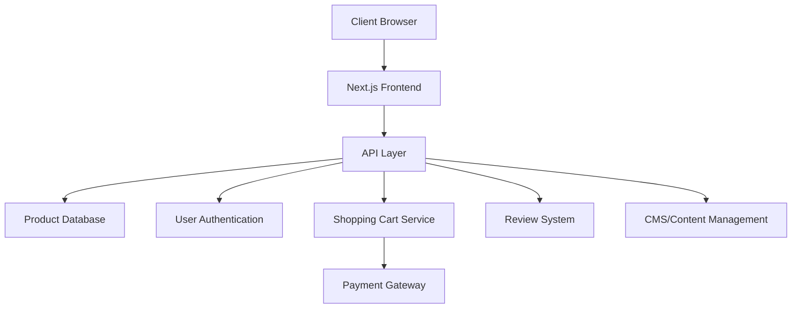

# Design Document - Ramen Bae E-commerce Clone

## Overview

This design document outlines the technical architecture and implementation approach for cloning The Ramen Bae e-commerce website. The application will be built as a modern, responsive web application using React/Next.js for the frontend, with a headless CMS or custom backend for content management, and integration with Shopify or a similar e-commerce platform for cart and checkout functionality.

## Architecture

### High-Level Architecture



### Technology Stack

**Frontend:**
- Next.js 15+ (Latest version with App Router)
- TypeScript for type safety
- Tailwind CSS for styling
- shadcn/ui for component library
- Framer Motion for animations
- React Query (TanStack Query) for data fetching
- Zustand for state management

**Backend:**
- Supabase (PostgreSQL database, Authentication, Storage, Real-time)
- Supabase Edge Functions for serverless backend logic
- Docker for local development and containerization
- Supabase Storage for image hosting

**Infrastructure:**
- Vercel for frontend hosting
- Supabase Cloud for backend services
- Docker Compose for local development environment


## Components and Interfaces

### Frontend Component Structure

```
src/
├── components/
│   ├── layout/
│   │   ├── Header.tsx
│   │   ├── Footer.tsx
│   │   ├── Navigation.tsx
│   │   └── MobileMenu.tsx
│   ├── product/
│   │   ├── ProductCard.tsx
│   │   ├── ProductGrid.tsx
│   │   ├── ProductDetail.tsx
│   │   ├── ProductCarousel.tsx
│   │   └── RelatedProducts.tsx
│   ├── cart/
│   │   ├── CartSidebar.tsx
│   │   ├── CartItem.tsx
│   │   ├── ProgressBar.tsx
│   │   └── CartRecommendations.tsx
│   ├── reviews/
│   │   ├── ReviewList.tsx
│   │   ├── ReviewCard.tsx
│   │   ├── ReviewForm.tsx
│   │   └── RatingHistogram.tsx
│   ├── ui/
│   │   ├── Button.tsx
│   │   ├── Modal.tsx
│   │   ├── Accordion.tsx
│   │   └── Input.tsx
│   └── animations/
│       ├── FloatingIngredients.tsx
│       └── SectionDivider.tsx
├── pages/
│   ├── index.tsx (Homepage)
│   ├── products/
│   │   ├── [slug].tsx (Product Detail)
│   │   └── index.tsx (Product Listing)
│   ├── collections/
│   │   └── [category].tsx
│   ├── about.tsx
│   ├── faq.tsx
│   └── contact.tsx
├── hooks/
│   ├── useCart.ts
│   ├── useProducts.ts
│   └── useAuth.ts
├── lib/
│   ├── api.ts
│   ├── shopify.ts
│   └── utils.ts
└── styles/
    └── globals.css
```

### Key Component Interfaces

**ProductCard Component:**
```typescript
interface ProductCardProps {
  id: string;
  name: string;
  price: number;
  image: string;
  hoverImage?: string;
  reviewCount: number;
  averageRating: number;
  badge?: 'sold-out' | 'new' | 'sale';
  accentColor?: string;
}
```

**CartSidebar Component:**
```typescript
interface CartSidebarProps {
  isOpen: boolean;
  onClose: () => void;
  items: CartItem[];
  subtotal: number;
  shippingThreshold: number;
  giftThresholds: GiftTier[];
}

interface CartItem {
  id: string;
  productId: string;
  name: string;
  price: number;
  quantity: number;
  image: string;
}
```


## Data Models

### Product Model
```typescript
interface Product {
  id: string;
  slug: string;
  name: string;
  description: string;
  price: number;
  compareAtPrice?: number;
  images: ProductImage[];
  category: ProductCategory;
  tags: string[];
  variants?: ProductVariant[];
  inventory: number;
  nutritionFacts?: NutritionFacts;
  ingredients: string[];
  allergens: string[];
  features: string[];
  accentColor: string;
  reviewStats: ReviewStats;
  createdAt: Date;
  updatedAt: Date;
}

interface ProductImage {
  url: string;
  alt: string;
  type: 'main' | 'hover' | 'gallery';
}

interface ProductCategory {
  id: string;
  name: string;
  slug: string;
  icon?: string;
}
```

### Cart Model
```typescript
interface Cart {
  id: string;
  userId?: string;
  sessionId: string;
  items: CartItem[];
  subtotal: number;
  shipping: number;
  tax: number;
  total: number;
  appliedGifts: Gift[];
  createdAt: Date;
  updatedAt: Date;
}

interface Gift {
  id: string;
  name: string;
  threshold: number;
  unlocked: boolean;
}
```

### Review Model
```typescript
interface Review {
  id: string;
  productId: string;
  userId: string;
  userName: string;
  rating: number;
  title?: string;
  body: string;
  verified: boolean;
  media: ReviewMedia[];
  helpful: number;
  createdAt: Date;
}

interface ReviewStats {
  averageRating: number;
  totalReviews: number;
  ratingDistribution: {
    5: number;
    4: number;
    3: number;
    2: number;
    1: number;
  };
}
```


## Error Handling

### Frontend Error Handling
- Implement error boundaries for React components to catch rendering errors
- Display user-friendly error messages for API failures
- Implement retry logic for failed network requests
- Show loading states during async operations
- Validate form inputs with clear error messages

### Backend Error Handling
- Use try-catch blocks for all async operations
- Return standardized error responses with appropriate HTTP status codes
- Log errors to monitoring service (e.g., Sentry)
- Implement rate limiting to prevent abuse
- Handle payment failures gracefully with clear user feedback

### Error Response Format
```typescript
interface ErrorResponse {
  success: false;
  error: {
    code: string;
    message: string;
    details?: any;
  };
}
```

## Testing Strategy

### Unit Testing
- Test individual components with React Testing Library
- Test utility functions and hooks
- Test data transformation logic
- Aim for 80%+ code coverage on critical paths

### Integration Testing
- Test API endpoints with Supertest
- Test database operations
- Test third-party integrations (Shopify, payment gateway)
- Test authentication flows

### End-to-End Testing
- Use Playwright or Cypress for E2E tests
- Test critical user journeys:
  - Browse products → Add to cart → Checkout
  - User registration and login
  - Product search and filtering
  - Review submission
- Test on multiple browsers and devices

### Performance Testing
- Lighthouse audits for performance metrics
- Load testing for API endpoints
- Image optimization validation
- Bundle size monitoring


## Design System

### Color Palette
```css
:root {
  /* Primary Colors */
  --color-primary: #fe90b8;
  --color-primary-light: #F999BF;
  --color-primary-dark: #ff3977;
  
  /* Secondary Colors */
  --color-secondary: #96da2f;
  --color-accent-orange: #e47e4a;
  --color-accent-red: #ff4100;
  
  /* Neutral Colors */
  --color-black: #000000;
  --color-white: #ffffff;
  --color-gray-light: #f5f5f5;
  --color-gray-dark: #333030;
  
  /* Functional Colors */
  --color-success: #4caf50;
  --color-error: #f44336;
  --color-warning: #ff9800;
}
```

### Typography
```css
/* Font Family */
--font-primary: 'Poppins', sans-serif;

/* Font Sizes */
--text-xs: 0.75rem;    /* 12px */
--text-sm: 0.875rem;   /* 14px */
--text-base: 1rem;     /* 16px */
--text-lg: 1.125rem;   /* 18px */
--text-xl: 1.25rem;    /* 20px */
--text-2xl: 1.5rem;    /* 24px */
--text-3xl: 1.875rem;  /* 30px */
--text-4xl: 2.25rem;   /* 36px */
--text-5xl: 3rem;      /* 48px */
```

### Spacing System
```css
--spacing-1: 0.25rem;  /* 4px */
--spacing-2: 0.5rem;   /* 8px */
--spacing-3: 0.75rem;  /* 12px */
--spacing-4: 1rem;     /* 16px */
--spacing-5: 1.25rem;  /* 20px */
--spacing-6: 1.5rem;   /* 24px */
--spacing-8: 2rem;     /* 32px */
--spacing-10: 2.5rem;  /* 40px */
--spacing-12: 3rem;    /* 48px */
--spacing-16: 4rem;    /* 64px */
```

### Animation Guidelines
- Use Framer Motion for complex animations
- Transition duration: 200-300ms for UI interactions
- Easing: ease-in-out for most transitions
- Floating ingredients: subtle continuous animation
- Hover effects: scale(1.05) with smooth transition
- Page transitions: fade and slide effects


## API Design

### REST API Endpoints

**Products:**
```
GET    /api/products              - List all products with pagination
GET    /api/products/:id          - Get single product details
GET    /api/products/category/:slug - Get products by category
GET    /api/products/search       - Search products
```

**Cart:**
```
POST   /api/cart                  - Create new cart
GET    /api/cart/:id              - Get cart details
POST   /api/cart/:id/items        - Add item to cart
PUT    /api/cart/:id/items/:itemId - Update cart item quantity
DELETE /api/cart/:id/items/:itemId - Remove item from cart
```

**Reviews:**
```
GET    /api/reviews/product/:id   - Get reviews for product
POST   /api/reviews               - Submit new review
PUT    /api/reviews/:id/helpful   - Mark review as helpful
```

**User:**
```
POST   /api/auth/register         - Register new user
POST   /api/auth/login            - User login
POST   /api/auth/logout           - User logout
POST   /api/auth/reset-password   - Password reset
GET    /api/user/profile          - Get user profile
```

### API Response Format
```typescript
// Success Response
interface SuccessResponse<T> {
  success: true;
  data: T;
  meta?: {
    page?: number;
    limit?: number;
    total?: number;
  };
}

// Error Response
interface ErrorResponse {
  success: false;
  error: {
    code: string;
    message: string;
    details?: any;
  };
}
```

## Security Considerations

1. **Authentication & Authorization:**
   - Implement JWT-based authentication
   - Use httpOnly cookies for token storage
   - Implement refresh token rotation
   - Rate limit authentication endpoints

2. **Data Protection:**
   - Encrypt sensitive data at rest
   - Use HTTPS for all communications
   - Sanitize user inputs to prevent XSS
   - Implement CSRF protection

3. **Payment Security:**
   - Never store credit card information
   - Use PCI-compliant payment gateway
   - Implement 3D Secure for card payments
   - Log all payment transactions

4. **API Security:**
   - Implement rate limiting
   - Use API keys for third-party integrations
   - Validate all input data
   - Implement proper CORS policies

