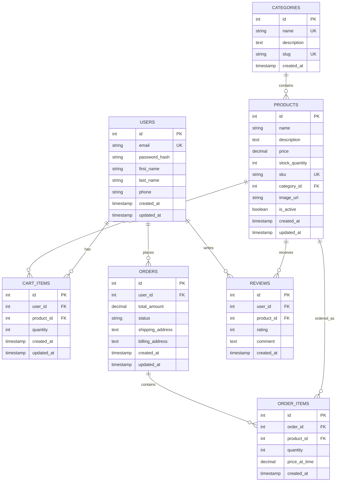

# 🗄️ E-commerce Database Schema Design

## 📊 Entity Relationship Diagram (ERD)



## 🧠 **Database Normalization Principles**

### **1st Normal Form (1NF)** ✅
- Each column contains atomic (indivisible) values
- No repeating groups
- Each row is unique

**Example**: Instead of storing multiple phone numbers in one field:
```sql
-- ❌ BAD: Multiple values in one column
users (id, name, phones)
(1, 'John', '555-1234, 555-5678')

-- ✅ GOOD: Separate table for phone numbers
users (id, name)
user_phones (id, user_id, phone, type)
```

### **2nd Normal Form (2NF)** ✅
- Must be in 1NF
- All non-key attributes depend on the entire primary key

**Example**: Our `order_items` table properly depends on both `order_id` and `product_id`:
```sql
-- ✅ GOOD: price_at_time depends on the specific order + product combination
order_items (order_id, product_id, quantity, price_at_time)
```

### **3rd Normal Form (3NF)** ✅  
- Must be in 2NF
- No transitive dependencies (non-key attributes don't depend on other non-key attributes)

**Example**: Product category information is in a separate table:
```sql
-- ❌ BAD: category_name depends on category_id, not product_id
products (id, name, category_id, category_name)

-- ✅ GOOD: Category information separated
products (id, name, category_id)
categories (id, name, description)
```

## 🔗 **Relationship Types Explained**

### **One-to-Many (1:M)**
- **Users → Orders**: One user can place many orders
- **Categories → Products**: One category contains many products  
- **Orders → Order Items**: One order contains many items

```sql
-- Foreign key in the "many" side points to "one" side
CREATE TABLE orders (
    id SERIAL PRIMARY KEY,
    user_id INTEGER REFERENCES users(id),  -- Many orders point to one user
    -- other fields...
);
```

### **Many-to-Many (M:M)**
Handled through junction tables:
- **Users ↔ Products (via Cart)**: Users can add many products to cart, products can be in many carts
- **Orders ↔ Products (via Order Items)**: Orders can contain many products, products can be in many orders

```sql
-- Junction table with foreign keys to both related tables
CREATE TABLE cart_items (
    id SERIAL PRIMARY KEY,
    user_id INTEGER REFERENCES users(id),
    product_id INTEGER REFERENCES products(id),
    quantity INTEGER NOT NULL
);
```

### **One-to-One (1:1)**
Less common, used for:
- Splitting large tables for performance
- Optional detailed information

```sql
-- Example: User profile details (not used in our schema, but here's how)
CREATE TABLE user_profiles (
    user_id INTEGER PRIMARY KEY REFERENCES users(id),
    bio TEXT,
    avatar_url VARCHAR(255),
    preferences JSONB
);
```

## 🏗️ **Why This Design?**

### **Scalability**
- **Normalized structure** prevents data duplication
- **Proper indexing** on foreign keys for fast queries
- **Separate concerns** (users, products, orders) for maintainability

### **Business Logic Support**
- **Order history**: Users can view all their past orders
- **Inventory management**: Track stock levels per product
- **Shopping cart**: Persistent cart across sessions
- **Product reviews**: Users can review products they've purchased
- **Category browsing**: Products organized by categories

### **Data Integrity**
- **Foreign key constraints** ensure referential integrity
- **Unique constraints** prevent duplicate data
- **Check constraints** enforce business rules
- **NOT NULL constraints** ensure required data

### **Query Flexibility**
This design supports common e-commerce queries:
```sql
-- User's order history with product details
SELECT o.id, o.created_at, p.name, oi.quantity, oi.price_at_time
FROM orders o
JOIN order_items oi ON o.id = oi.order_id  
JOIN products p ON oi.product_id = p.id
WHERE o.user_id = 123;

-- Products in a category with average ratings
SELECT p.name, p.price, AVG(r.rating) as avg_rating
FROM products p
LEFT JOIN reviews r ON p.id = r.product_id
WHERE p.category_id = 5
GROUP BY p.id, p.name, p.price;

-- User's current cart total
SELECT u.email, SUM(p.price * ci.quantity) as cart_total
FROM users u
JOIN cart_items ci ON u.id = ci.user_id
JOIN products p ON ci.product_id = p.id  
WHERE u.id = 123
GROUP BY u.id, u.email;
```

## 🚀 **Next Steps**

1. **Implement this schema** in SQL
2. **Add sample data** for testing
3. **Practice complex queries** with JOINs
4. **Understand query performance** and indexing
5. **Compare to your API endpoints** from Task 0.1

This foundation will power your entire Ramen Bae e-commerce application! 🍜 