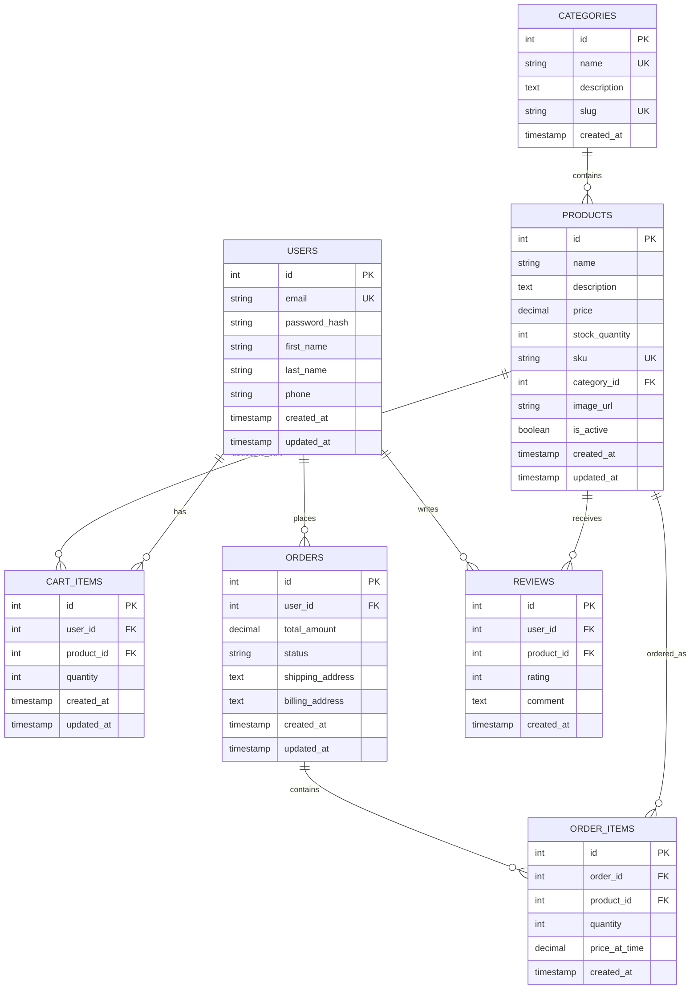

# 🔄 Auto-Generated Database ERD

> Generated on: 2025-06-27T06:46:31.404Z
> Database: learning_db

## Current Database Schema



## 📊 Database Statistics

- **Tables**: 7
- **Total Columns**: 50
- **Relationships**: 8

## 🔄 How to Regenerate

To update this ERD after schema changes:

```bash
cd Learning/0.2-Database-Design
node generate-erd.js
```

---
*This ERD was automatically generated from your PostgreSQL database schema.*
